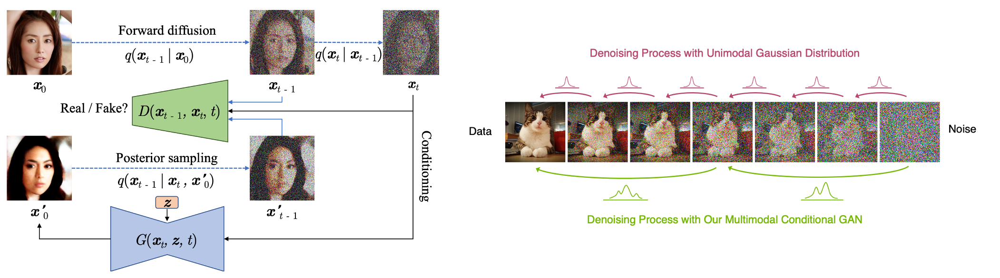

## DDGAN &mdash; TensorFlow Implementation [[Project page]](https://nvlabs.github.io/denoising-diffusion-gan/)
### : Tackling the Generative Learning Trilemma with Denoising Diffusion GANs (ICLR 2022 Spotlight)

<div align="center">
  
</div>

## Usage
### Train
```
> python main.py --dataset FFHQ
```

### Test
```
> python main.py --dataset FFHQ --phase test
```

## Results (256x256)
### CelebA-HQ
<div align="left">
  
</div>

### FFHQ
<div align="left">
  
</div>

## Author
* [Junho Kim](http://bit.ly/jhkim_resume)
