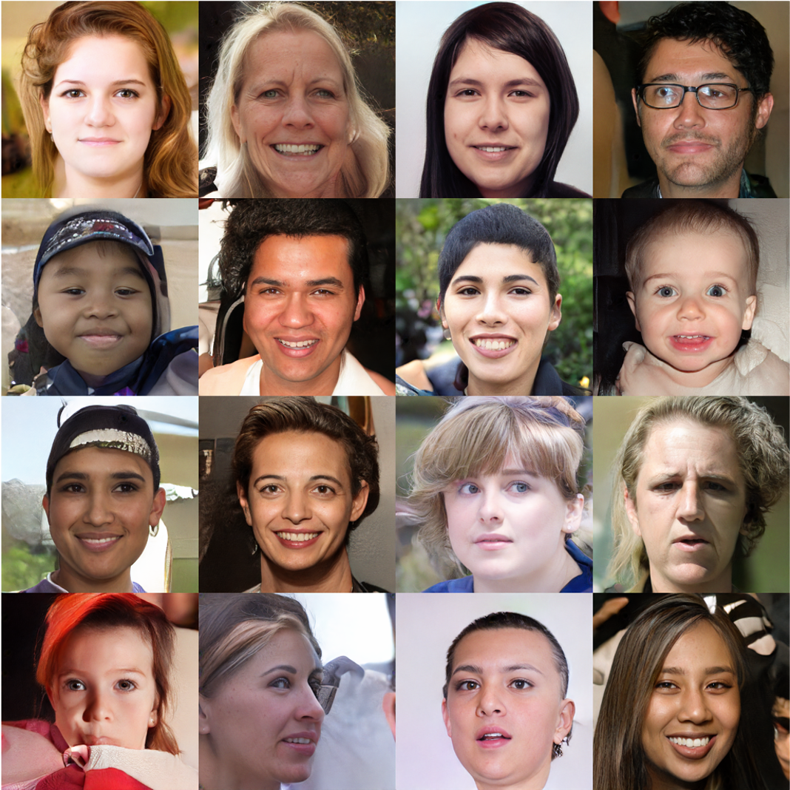

## DDGAN &mdash; TensorFlow Implementation [[Project page]](https://nvlabs.github.io/denoising-diffusion-gan/)
### : Tackling the Generative Learning Trilemma with Denoising Diffusion GANs (ICLR 2022 Spotlight)

<div align="center">
  
</div>

> **Abstract** *A wide variety of deep generative models has been developed in the past decade. Yet, these models often struggle with simultaneously addressing three key require- ments including: high sample quality, mode coverage, and fast sampling. We call the challenge imposed by these requirements the generative learning trilemma, as the existing models often trade some of them for others. Particularly, denoising diffusion models have shown impressive sample quality and diversity, but their ex- pensive sampling does not yet allow them to be applied in many real-world appli- cations. In this paper, we argue that slow sampling in these models is fundamen- tally attributed to the Gaussian assumption in the denoising step which is justified only for small step sizes. To enable denoising with large steps, and hence, to re- duce the total number of denoising steps, we propose to model the denoising distri- bution using a complex multimodal distribution. We introduce denoising diffusion generative adversarial networks (denoising diffusion GANs) that model each de- noising step using a multimodal conditional GAN. Through extensive evaluations, we show that denoising diffusion GANs obtain sample quality and diversity com- petitive with original diffusion models while being 2000× faster on the CIFAR-10 dataset. Compared to traditional GANs, our model exhibits better mode coverage and sample diversity. To the best of our knowledge, denoising diffusion GAN is the first model that reduces sampling cost in diffusion models to an extent that al- lows them to be applied to real-world applications inexpensively.*

## Usage
### Train
```
> python main.py --dataset FFHQ
```

### Test
```
> python main.py --dataset FFHQ --phase test
```

## Results (256x256)
### CelebA-HQ
<div align="left">
  
</div>

### FFHQ
<div align="left">
  
</div>

## Author
* [Junho Kim](http://bit.ly/jhkim_resume)
